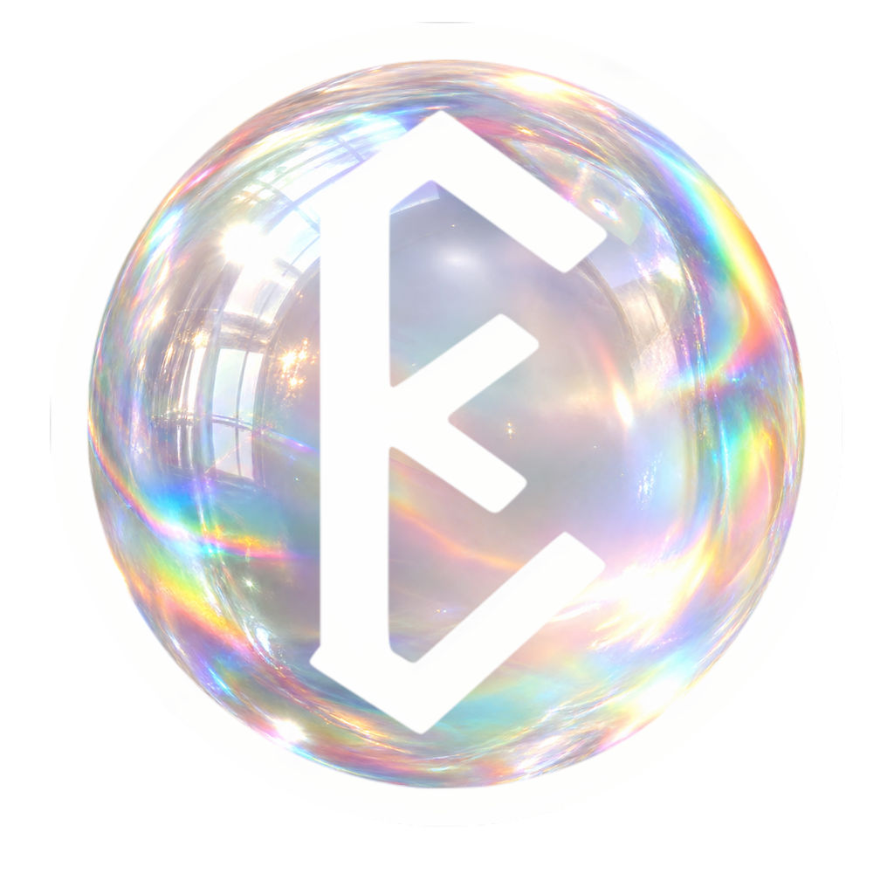

<!-- NULLALABS PUBLIC PROFILE -->

  

  

    <code>[ LOCAL-FIRST ]</code> &nbsp;•&nbsp;
    <code>[ EVIDENCE-LED ]</code> &nbsp;•&nbsp;
    <code>[ REVERSIBLE ]</code> &nbsp;•&nbsp;
    <code>[ SOVEREIGN BY DESIGN ]</code> &nbsp;•&nbsp;
    <code>[ FRUGAL ]</code> &nbsp;•&nbsp;
    <code>[ PORTABLE ]</code> &nbsp;•&nbsp;
    <code>[ INTERACTIVE ]</code> &nbsp;•&nbsp;
    <code>[ USER-FRIENDLY ]</code>
  

  

    
    
    
  

---

## Ethernium :: NullaLabs

**NullaLabs** is the personal research and engineering identity behind
**Ethernium**: local-first software, bounded automation, explicit authority and
claims that remain proportional to reproducible evidence.

The profile deliberately separates three things:

| Surface | Meaning | Evidence boundary |
| :--- | :--- | :--- |
| **Public software** | Repositories and packages that can be inspected now | Source, tests and releases are linked below |
| **Private engineering** | Active ecosystem components under controlled development | A name or diagram is not a public release |
| **Visual research** | Interface language, shaders and interaction studies | Visual artifacts are not physical or scientific proof |

  
  
Public engineering surface — four independently inspectable projects.

---

## Public systems

### 01 // Chronolith

<table>
<tr>
<td width="58%" valign="middle">

**Continuity and integrity evidence for long-running human–AI projects**

Canonical state, Merkle evidence, signatures and independently checkable
provenance. Hashes establish byte integrity; they do not by themselves prove
authorship, safety or semantic truth.

- Deterministic evidence records and project baselines
- Continuity artifacts for work that spans sessions
- Python distributions with explicit edition boundaries

[Source repository](https://github.com/NullaLabs/CHRONOLITH-by-Ethernium) ·
[Published package](https://pypi.org/project/chronolith-pro/)

</td>
<td width="42%" valign="middle">
  
</td>
</tr>
</table>

---

### 02 // Seneschal

<table>
<tr>
<td width="42%" valign="middle">
  
</td>
<td width="58%" valign="middle">

**Consultative context-cost and security preflight for AI workflows**

Bounded BM25 retrieval, secret and prompt-injection checks, signed grants and
an audit ledger. Seneschal advises; the authorized runtime retains execution
authority.

- Local and deterministic context selection
- Explicit findings instead of hidden mutation
- Zero-runtime-dependency Python package

[Source repository](https://github.com/NullaLabs/SENESCHAL-by-Ethernium) ·
[Published package](https://pypi.org/project/seneschal/)

</td>
</tr>
</table>

---

### 03 // Fonts Forge

<table>
<tr>
<td width="58%" valign="middle">

**Raster-specimen to OpenType tooling**

Automatic layout detection, vector generation, a local studio and regression
tests for producing TTF/WOFF/WOFF2 artifacts. The repository is
source-available under its own license; it is not MIT.

- Raster layout analysis and glyph extraction
- Bézier/vector generation and font assembly
- Local workflow with test-backed release metadata

[Source repository](https://github.com/NullaLabs/FONTS-FORGE-by-Ethernium)

</td>
<td width="42%" valign="middle">
  
</td>
</tr>
</table>

---

### 04 // KAPTURA

<table>
<tr>
<td width="42%" valign="middle">
  
</td>
<td width="58%" valign="middle">

**Local-first browser capture and real media processing**

Screen/tab capture plus WebM, MP4 and GIF processing with Lanczos scaling.
Neural upscaling is not performed by the browser; an authorized operator may
hand a saved master to a separate private companion.

- Browser-native capture
- Real transcoding and GIF encoding paths
- Explicit boundary between deterministic scaling and private AI tooling

[Source repository](https://github.com/NullaLabs/KAPTURA-by-Ethernium)

</td>
</tr>
</table>

---

## Private ecosystem boundary

### Ethernium Orb // Windows endpoint research

<table>
<tr>
<td width="58%" valign="middle">

**Private Windows endpoint-security project within the Ethernium family**

Orb packages a native Windows host/service and AMSI-related binaries alongside
the PROTEKTA TypeScript defense engine. Android, Linux and robotics variants
exist as separate private repositories. PROTEKTA is the shared defensive
research layer; Orb is a product-facing family, not a synonym for the entire
ecosystem.

**Current maturity: private implementation under validation, not a certified
EDR release.** Unit tests exist, but clean build, durable recovery and physical
endpoint-protection gates have not all passed. Claims such as 0% idle CPU,
hostile-attack resistance or deployment readiness are not made by this profile.

</td>
<td width="42%" valign="middle">
  
</td>
</tr>
</table>

---

<table>
<tr>
<td align="center"><strong>FRUGAL</strong> local cognitive kernel</td>
<td align="center"><strong>CHRONOLITH</strong> integrity evidence</td>
<td align="center"><strong>SENESCHAL</strong> consultative preflight</td>
</tr>
<tr>
<td align="center"><strong>INVICTVS</strong> visual control surface</td>
<td align="center"><strong>THESTRAL</strong> IDE / control plane</td>
<td align="center"><strong>EXEKUTION</strong> controlled execution research</td>
</tr>
</table>

These labels describe the intended separation of responsibilities. Components
without a linked public repository and reproducible release remain private or
in development. Internal screenshots, simulations and unit tests do not prove
deployment in a physical or hostile environment.

> **Evidence rule:** latency, bypass ratio, CPU/GPU use, frame rate, security
> efficacy and external anchoring apply only to the exact artifact, hardware
> and procedure recorded with the measurement.

---

## Visual research

  
  
Educational repeating base-pair motif — not a genomic sequence.

  
  
Interface visualization — not an experimental physics result.

---

## Engineering doctrine

| Principle | Operational consequence |
| :--- | :--- |
| **Frugal routing** | Deterministic and symbolic paths precede neural/cloud escalation |
| **Controlled authority** | A UI, model or advisory component has no hidden mutation power |
| **Promotion gates** | External input moves through source → mapped → adapter → tested → promoted |
| **Release hygiene** | Source, release, evidence and cold archive remain distinct |
| **Honest limits** | Missing physical or external proof is recorded, never simulated as success |
| **Rollback** | Meaningful changes remain reviewable, reconstructable and reversible |

## Working stack

  
  
  
  
  

    

  
  
  
  
  

---

## Direction

Build useful local-first systems whose components remain understandable on
their own, whose integrations are contractual, and whose claims can be tested
without trusting the presentation.

  
    
  
   
  <strong>ETHERNIUM ECOSYSTEM</strong> · Public profile contract reviewed 2026-09-21

